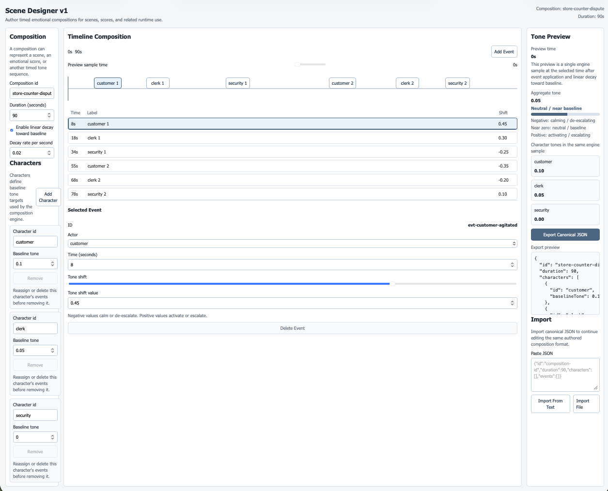
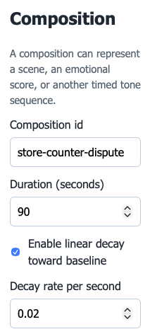
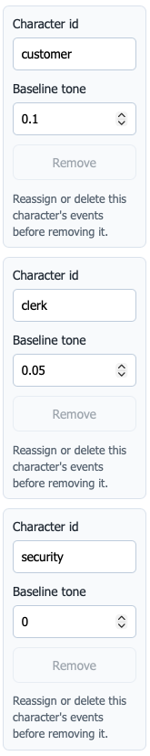
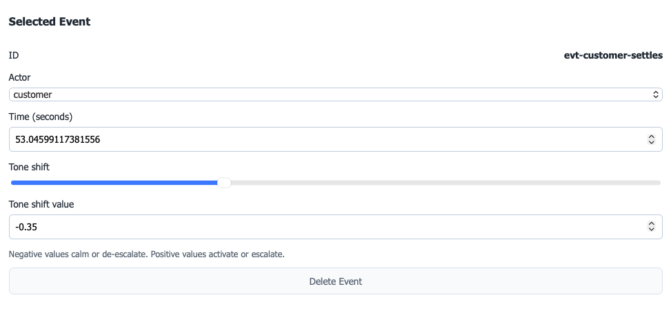
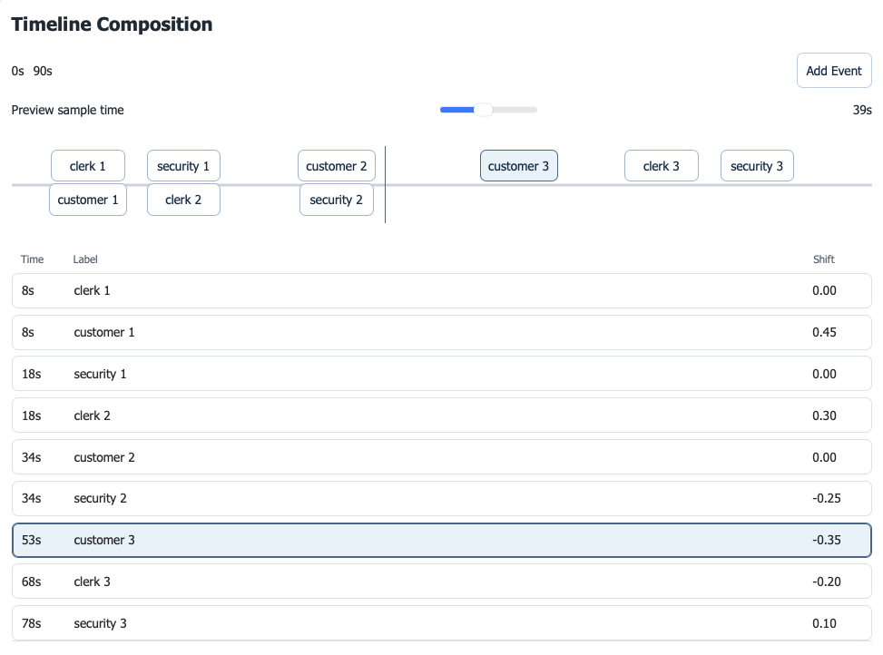
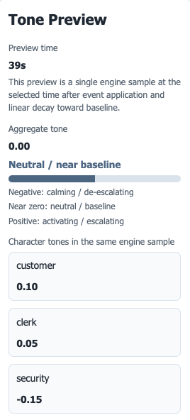
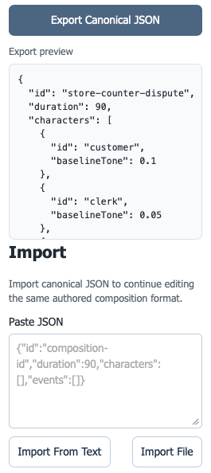

# Scene Designer v1 — Instructions

This document explains how to use the Scene Designer v1 editor to create and edit timed emotional compositions.

A composition can represent:
- a dramatic scene
- an emotional score
- a structured narrative sequence
- any timeline where tone shifts over time


The editor allows you to define characters, place tone events on a timeline, preview the resulting tone state, and export the composition as canonical JSON.



## 1. Starting the Editor

Install dependencies:

```bash
npm install
```

Start the development server:

```bash
npm run dev
```

Vite will print a local URL in the terminal, typically something like:

```
http://localhost:5173
```

Open that URL in your browser.

The Scene Designer editor will load with an example composition.

## 2. Understanding the Composition Model

A composition includes:
- a composition id
- a duration
- optional tone decay
- a set of characters
- a set of timed events

Characters define baseline tone anchors.

Events apply tone shifts at specific times.

The engine samples tone values across the timeline to produce the preview state.

## 3. Editing Composition Settings

At the top of the editor you can edit:

- **Composition ID**  
  A simple identifier for the composition.
- **Duration**  
  The total timeline length in seconds.
- **Decay Enabled**  
  When enabled, tones gradually move back toward their baseline over time.
- **Decay Rate**  
  The speed at which tone returns toward baseline.


These values affect preview behavior and exported JSON.



## 4. Editing Characters

Characters represent tone anchors within the composition.

Each character has:

- **an id**
- **a baseline tone**

Baseline tone values must remain within:

```
[-1, 1]
```

**What you can do**

- rename characters
- adjust baseline tone
- add new characters
- remove characters

Characters cannot be removed if events still reference them.


Character IDs must remain unique.



## 5. Adding and Editing Events

Events define tone changes over time.

Each event contains:

- **an event id**
- **a time (in seconds)**
- **an actor (character)**
- **a toneShift**

**Event controls**

You can:

- add a new event
- select an event
- drag the event horizontally on the timeline
- change its actor
- change its tone shift
- delete the event

**Tone shift meaning**

Positive tone shifts increase activation or escalation.

Example:

```
toneShift: 0.4
```

Negative tone shifts calm or reduce intensity.

Example:

```
toneShift: -0.3
```


All tone values are clamped to:

```
[-1, 1]
```



## 6. Using the Timeline

The timeline represents the full duration of the composition.

Each marker represents an event.

**Timeline actions**

- drag markers horizontally to change event time
- select markers to edit their properties
- events stack vertically when they occur close together


Dragging an event will update its time directly in the composition data.



## 7. Understanding Tone Preview

The Tone Preview panel shows a sampled engine state at a selected preview time.

The preview displays:

- **Aggregate Tone**
- **Character tone values**

Aggregate tone is calculated as:

```
average(character tones)
```

Character tones are determined by:

1. baseline tone  
2. applied event tone shifts  
3. optional decay toward baseline


The preview shows a single deterministic sample, not a playback animation.



## 8. Exporting a Composition

Click Export to download the current composition.

The file will contain canonical JSON in the format:

```
SceneDefinition
```

The exported JSON matches the editor state exactly.

No transformation or runtime formatting is applied.

## 9. Importing a Composition

You can import JSON that follows the canonical schema.

Import will:

- parse the JSON
- validate the structure
- reject invalid data


If the data fails validation, the editor will show an error rather than silently modifying the data.



## 10. Example Composition JSON

Example minimal composition:

```json
{
  "id": "example-composition",
  "duration": 20,
  "characters": [
    { "id": "customer", "baselineTone": 0.2 },
    { "id": "clerk", "baselineTone": 0.1 }
  ],
  "events": [
    { "id": "evt-1", "time": 5, "actor": "customer", "toneShift": 0.4 },
    { "id": "evt-2", "time": 10, "actor": "clerk", "toneShift": -0.2 }
  ],
  "decay": {
    "enabled": true,
    "decayRatePerSecond": 0.1
  }
}
```

## 11. Current Limitations

Scene Designer v1 is intentionally minimal.

Current limitations include:

- tone is a single scalar axis
- preview shows sampled states rather than playback
- no multi-dimensional emotional model
- no runtime-specific export formats

Future versions may expand capabilities if the tool proves useful.
